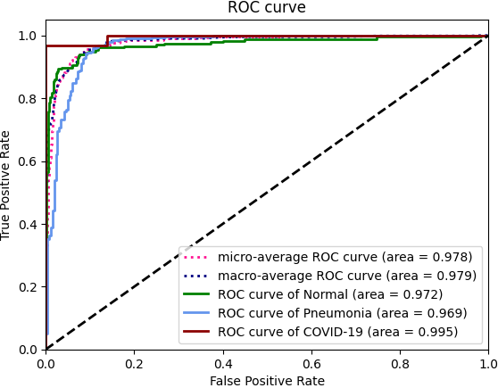
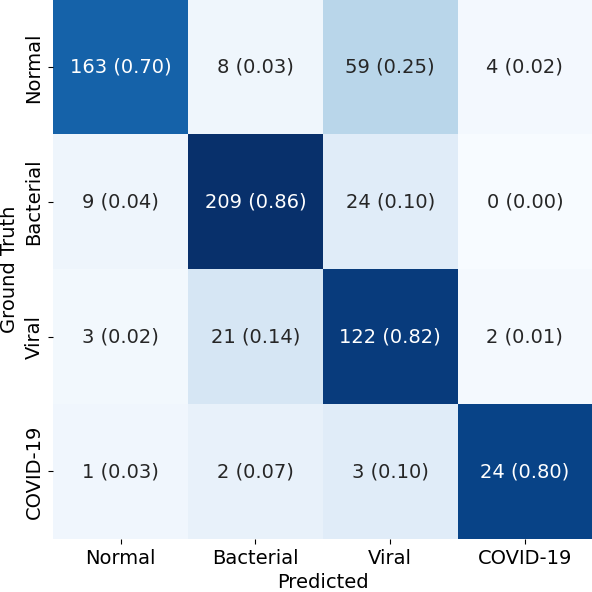

# CovidAID for Detection of COVID-19 from X-Ray Images

The emergence of the Covid-19 pandemic in 2020 took a toll on almost all individuals across the globe and is continuing to do so even today. With case load reaching as high as one million per day, the issues of test kit and hospital availability were encountered by all. 

This repository contains `CovidAID`, a PyTorch based implementation, to identify COVID-19 cases from X-Ray images. This implementation also performs 3 class and 4 class classifications. The model takes as input a chest X-Ray image and outputs the probability scores for 4 classes (`NORMAL`, `Bacterial Pneumonia`, `Viral Pneumonia` and `COVID-19`).

It is based on [CheXNet](https://stanfordmlgroup.github.io/projects/chexnet/) (and it's reimplementation by [arnoweng](https://github.com/arnoweng/CheXNet)).


## Installation
Please refer to [INSTALL.md](./INSTALL.md) for installation.

## Dataset
`CovidAID` uses the [covid-chestxray-dataset](https://github.com/ieee8023/covid-chestxray-dataset) for COVID-19 X-Ray images and [chest-xray-pneumonia](https://www.kaggle.com/paultimothymooney/chest-xray-pneumonia) dataset for data on Pneumonia and Normal lung X-Ray images. 

### Data Distribution
Chest X-Ray image distribution
|  Type | Normal | Bacterial Pneumonia | Viral Pneumonia | COVID-19 | Total |
|:-----:|:------:|:---------:|:--------:|:--------:|:-----:|
| Train |  1341  |    2530 |  1337  |   115   | 5323 |
| Val   | 8 | 8 | 8 | 10 | 34
|  Test |   234 | 242 | 148  |  30   |   654 |

Chest X-Ray patient distribution
|  Type | Normal | Bacterial Pneumonia | Viral Pneumonia | COVID-19 | Total |
|:-----:|:------:|:---------:|:--------:|:--------:|:-----:|
| Train |  1000  |   1353 | 1083   |   80   | 3516 |
| Val   | 8 | 7 | 7 | 7 | 29
|  Test |   202 | 77 | 126  |  19   |   424 |


## Get started
The [paper](http://arxiv.org/abs/2004.09803) contains a more detailed explanation the of architecture and method. Refer to [GETTING_STARTED.md](./GETTING_STARTED.md) for detailed examples and abstract usage for training the models and running inference.

## Results

The results are displayed as per-class AUROC (Area under ROC curve), as well as confusion matrix formed by treating the most confident class prediction as the final prediction. We obtain an AUROC for Covid detection to be of `0.988` (4-class configuration) and `0.995` (3-class configuration).

<center>
<table>
<tr><th></th><th>3-Class Classification</th><th>4-Class Classification</th></tr>
<tr>
<td></td>
<td>

| Pathology  |   AUROC    | Sensitivity | PPV
| :--------: | :--------: | :--------: | :--------: |
| Normal Lung  | 0.972 | 0.744 | 0.989
| Bacterial Pneumonia | 0.969 | 0.995 | 0.868
| COVID-19 | 0.995 | 1.000 | 0.968

</td><td>

| Pathology  |   AUROC    | Sensitivity | PPV
| :--------: | :--------: | :--------: | :--------: |
| Normal Lung  | 0.979 | 0.761 | 0.989
| Bacterial Pneumonia | 0.974 | 0.961 | 0.881
| Viral Pneumonia | 0.861 | 0.872 | 0.721
| COVID-19 | 0.997 | 1.000 | 0.938

</td></tr> 
<tr>
<td>ROC curve</td>
<td>



</td><td>


</td>
</tr>
<tr>
<td>Confusion Matrix</td>
<td>


</td><td>



</td>
</tr>


</table>
</center>

## Visualizations
Using RISE, the saliency  maps were generated for  our model’s  predictions to validate the predictions from the model.
<center>

<table>
<tr>
<td>

 

</td><td> 

<tr><td> 

 

</td><td> 

</table>


</center>

## Contributions

This work was collaboratively done by Tejas Umesh, Andrew Wasserbeck, and Ashwin Kannan. All members contributed equally to this project.

## Contact
If you have any question, please contact any of the team members.
```
Tejas Umesh: tumesh@asu.edu 
Andrew Wasserbeck: awasser4@asu.edu 
Ashwin Kannan: akanna17@asu.edu 
```
